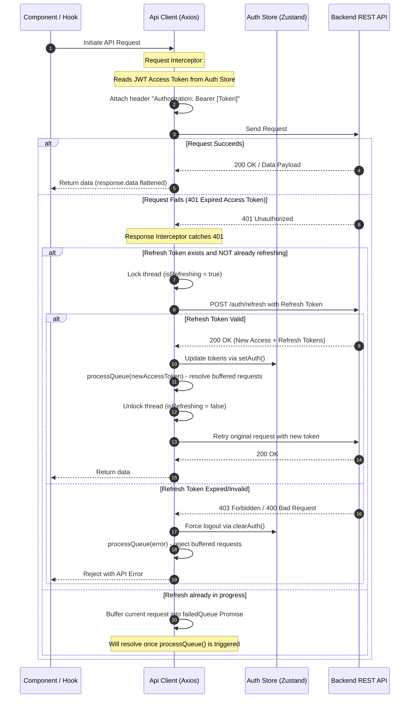

# Project Onboarding & Architecture Guide

Welcome! This document serves as a comprehensive developer guide and architectural review for the frontend codebase of the Enterprise SaaS application. It is designed to help developers of all experience levels understand the project structure, state management patterns, API integration workflows, security mechanisms, and scalability pathways.

---

## 1. High-Level Folder Structure

To maintain a clean and modular workspace, the root directory isolates configuration files, while all application logic lives inside the `src` folder.

| Directory | Core Architectural Responsibility | Key Integration Example |
| :--- | :--- | :--- |
| [`src/app`](file:///d:/Professional%20Projects/Purelis%20Beauty/front-end/src/app) | **Next.js App Router (Routes)**. Handles application routing, root layouts, route groups, and sub-layouts. | `(dashboard)/dashboard/overview/page.tsx` |
| [`src/config`](file:///d:/Professional%20Projects/Purelis%20Beauty/front-end/src/config) | **App Configuration**. Holds validated environment variables and general site settings config maps. | `env.ts` (Zod validation for env variables) |
| [`src/constants`](file:///d:/Professional%20Projects/Purelis%20Beauty/front-end/src/constants) | **Global Constants**. Centralizes backend API routes and client path mappings to prevent magic strings. | `routes.ts`, `api.ts` |
| [`src/features`](file:///d:/Professional%20Projects/Purelis%20Beauty/front-end/src/features) | **Domain-Driven Features**. Encapsulates business logic, page components, hooks, and wrappers by feature domain. | `auth/components/ProtectedRoute.tsx` |
| [`src/components`](file:///d:/Professional%20Projects/Purelis%20Beauty/front-end/src/components) | **Shared Global Components**. Houses reusable UI elements (e.g. buttons, modals, dropdowns) and layouts. | `ui/button.tsx` |
| [`src/services`](file:///d:/Professional%20Projects/Purelis%20Beauty/front-end/src/services) | **API Integration Layer**. Configures the Axios client, HTTP interceptor pipeline, and server communication services. | `api/api-client.ts`, `auth/auth-service.ts` |
| [`src/stores`](file:///d:/Professional%20Projects/Purelis%20Beauty/front-end/src/stores) | **Global Client State**. Stores global shared state across multiple routes using lightweight Zustand stores. | `auth-store.ts`, `notification-store.ts` |
| [`src/hooks`](file:///d:/Professional%20Projects/Purelis%20Beauty/front-end/src/hooks) | **Global React Hooks**. Reusable hooks independent of any specific business features. | `use-debounce.ts`, `use-local-storage.ts` |
| [`src/lib`](file:///d:/Professional%20Projects/Purelis%20Beauty/front-end/src/lib) | **Third-party Library Configurations**. Bootstraps client libraries like TanStack Query clients. | `query-client.ts`, `utils.ts` |
| [`src/providers`](file:///d:/Professional%20Projects/Purelis%20Beauty/front-end/src/providers) | **React Context Providers**. Wraps children in global providers (e.g. Query Client, Theme Provider). | `query-client-provider.tsx` |
| [`src/schemas`](file:///d:/Professional%20Projects/Purelis%20Beauty/front-end/src/schemas) | **Zod Data Schemas**. Declares type-safe validation schemas for frontend form validations and API payloads. | `auth.ts` (Login/Register schema templates) |
| [`src/types`](file:///d:/Professional%20Projects/Purelis%20Beauty/front-end/src/types) | **TypeScript Type Definitions**. Core types and interfaces shared globally across features. | `user.d.ts`, `api.d.ts` |
| [`src/utils`](file:///d:/Professional%20Projects/Purelis%20Beauty/front-end/src/utils) | **Pure Javascript Helpers**. Side-effect free formatting, calculation, and assertion helpers. | `format.ts`, `validation.ts` |

---

## 2. In-Depth Architectural Components

### A. Next.js Routing Architecture ([`src/app`](file:///d:/Professional%20Projects/Purelis%20Beauty/front-end/src/app))

The project is built on Next.js 15+ App Router, utilizing **Route Groups** to logically organize layout wrappers without altering the browser URL path:

*   **Public Website (`src/app/(website)`)**: Contains the marketing website pages (e.g. pricing, about, blog). The layout [`src/app/(website)/layout.tsx`](file:///d:/Professional%20Projects/Purelis%20Beauty/front-end/src/app/(website)/layout.tsx) renders the standard header and footer.
*   **Authentication Portal (`src/app/(auth)`)**: Isolates authentication forms (login, sign-up, verification, password recovery). The layout [`src/app/(auth)/layout.tsx`](file:///d:/Professional%20Projects/Purelis%20Beauty/front-end/src/app/(auth)/layout.tsx) wraps pages in a guest-only [`PublicRoute`](file:///d:/Professional%20Projects/Purelis%20Beauty/front-end/src/features/auth/components/PublicRoute.tsx) wrapper. This immediately routes authenticated users back to the dashboard if they manually navigate to `/login`.
*   **Secure Dashboard (`src/app/(dashboard)`)**: Contains the protected client-side SaaS console (billing, analytics, users, settings). The layout [`src/app/(dashboard)/layout.tsx`](file:///d:/Professional%20Projects/Purelis%20Beauty/front-end/src/app/(dashboard)/layout.tsx) wraps everything in the [`ProtectedRoute`](file:///d:/Professional%20Projects/Purelis%20Beauty/front-end/src/features/auth/components/ProtectedRoute.tsx) logic.

**Development Standard:** Page files (`page.tsx`) must remain minimal. They should only load the root feature components and inject layout wrappers. Business logic, hooks, state listeners, and sub-components must be delegated to the `src/features` directory.

---

### B. Domain-Driven Feature Modules ([`src/features`](file:///d:/Professional%20Projects/Purelis%20Beauty/front-end/src/features))

Rather than spreading files across flat global directories, we implement a **Domain-Driven/Feature-Based Architecture**. A feature module gathers all components, hooks, custom utilities, and sub-routes related to a specific domain (e.g. `auth`, `billing`, `users`):

```
src/features/auth/
├── index.ts                     # Public API barrel file
├── components/                  # Feature-specific UI components
│   ├── ProtectedRoute.tsx       # Auth route wrapper
│   ├── PublicRoute.tsx          # Guest route wrapper
│   └── RoleGuard.tsx            # Access gate based on UserRole
└── hooks/                       # Custom query/mutation hooks
    └── use-auth-mutations.ts    # React Query auth bindings
```

**Development Standard:** A feature folder must expose its public interfaces through a barrel index file (`index.ts`). External code must only import from the root barrel (e.g. `import { ProtectedRoute } from "@/features/auth"`) to prevent deep-import spaghetti.

---

### C. Client & Server State Boundaries ([`src/stores`](file:///d:/Professional%20Projects/Purelis%20Beauty/front-end/src/stores) vs. React State)

State is divided into three tiers:
1.  **Server State**: Injected, cached, and synchronized using **TanStack Query** (managed under [`src/lib/query-client.ts`](file:///d:/Professional%20Projects/Purelis%20Beauty/front-end/src/lib/query-client.ts)).
2.  **Global Client State**: Shared across distinct views, pages, or layouts using **Zustand**.
3.  **Local UI State**: Managed with React's native hooks (`useState`, `useReducer`) or form libraries (`react-hook-form`).

#### Analysis of Configured Zustand Stores:
*   [`auth-store.ts`](file:///d:/Professional%20Projects/Purelis%20Beauty/front-end/src/stores/auth-store.ts): Persists user metadata, access token, and refresh token in `localStorage`. Automatically recovers authentication state upon reload.
*   [`theme-store.ts`](file:///d:/Professional%20Projects/Purelis%20Beauty/front-end/src/stores/theme-store.ts): Manages active app-wide visual themes (`light`, `dark`, or `system`), synced with a client-side provider to avoid visual hydration mismatch.
*   [`loading-store.ts`](file:///d:/Professional%20Projects/Purelis%20Beauty/front-end/src/stores/loading-store.ts): Global loading lock, which pages can trigger to display fullscreen loader overlays during transitions or critical API requests.
*   [`modal-store.ts`](file:///d:/Professional%20Projects/Purelis%20Beauty/front-end/src/stores/modal-store.ts): A generic programmatic modal manager, containing metadata for dynamic dialog states (e.g. deletion confirmation dialogs, plan upgrades) and action callbacks.
*   [`notification-store.ts`](file:///d:/Professional%20Projects/Purelis%20Beauty/front-end/src/stores/notification-store.ts): An in-memory queue management store that triggers and coordinates transient toast popups.

---

### D. Secure API Interceptor & Token Refresh Pipeline ([`src/services/api/api-client.ts`](file:///d:/Professional%20Projects/Purelis%20Beauty/front-end/src/services/api/api-client.ts))

The system features a custom Axios client instance built to support production token rotation workflows.



#### Core Components of the Axios Pipeline:
1.  **Request Interceptor**: Synchronously extracts the JWT access token from the Zustand state at request-time and appends it to the `Authorization` header.
2.  **Response Interceptor (Data Flattening)**: Intercepts successful responses and strips out Axios envelopes, returning `response.data` directly to simplify consumer syntax.
3.  **Automatic 401 Retry Buffer**:
    *   If a request yields a `401 Unauthorized` status, it flags that the access token is likely expired.
    *   If a token refresh is already underway, subsequent failed requests are pushed into a `failedQueue` queue as promises, preventing API call duplication.
    *   If no refresh is running, it locks the interceptor (`isRefreshing = true`) and sends a `POST /auth/refresh` payload using the stored `refreshToken`.
    *   Upon a successful refresh request, the store is updated, the original request is executed with the new token, and the buffered queue is drained and retried.
    *   If the token refresh call fails, the store is wiped (`clearAuth`), the promise queue is rejected, and the user is redirected back to the login screen.

---

### E. Environment Variable Validation ([`src/config/env.ts`](file:///d:/Professional%20Projects/Purelis%20Beauty/front-end/src/config/env.ts))

To prevent runtime failures caused by missing environment variables, the system includes a startup parsing check using Zod:

```typescript
const envSchema = z.object({
  NEXT_PUBLIC_API_URL: z.string().url().default("http://localhost:5000/api/v1"),
  NEXT_PUBLIC_APP_URL: z.string().url().default("http://localhost:3000"),
  NODE_ENV: z.enum(["development", "production", "test"]).default("development"),
});
```

During application startup, `envSchema.safeParse` executes. If validation fails in a `production` environment, the build is halted immediately (`throw new Error("Invalid environment variables")`). This ensures configuration errors are caught during build/CI rather than failing silently on client browsers.

---

## 3. How to Add Frontend and Backend Features

Follow these steps to build end-to-end features in this project.

### Step 1: Create Zod Schema Validation
Define the validation rules in the schema layer, ensuring client and server specifications match. Let's create an onboarding schema in [`src/schemas/user.ts`](file:///d:/Professional%20Projects/Purelis%20Beauty/front-end/src/schemas/user.ts):
```typescript
export const onboardingSchema = z.object({
  companyName: z.string().min(2, "Company name must contain at least 2 characters"),
  employeeCount: z.number().int().min(1, "Must declare at least 1 employee"),
});

export type OnboardingInput = z.infer<typeof onboardingSchema>;
```

### Step 2: Add API Endpoints & Routes Constants
Add static routes to keep components decoupled from configuration details:
1.  **Client Route Path** ([`src/constants/routes.ts`](file:///d:/Professional%20Projects/Purelis%20Beauty/front-end/src/constants/routes.ts)):
    ```typescript
    DASHBOARD: {
      ONBOARDING: "/dashboard/onboarding",
    }
    ```
2.  **Server API Route Path** ([`src/constants/api.ts`](file:///d:/Professional%20Projects/Purelis%20Beauty/front-end/src/constants/api.ts)):
    ```typescript
    USERS: {
      ONBOARD: "/users/onboard",
    }
    ```

### Step 3: Write the Service Call Wrapper
Implement service hooks within [`src/services`](file:///d:/Professional%20Projects/Purelis%20Beauty/front-end/src/services). Keep functions asynchronous, type-safe, and isolated:
```typescript
// src/services/users/user-service.ts
import { OnboardingInput } from "@/schemas/user";

export const userService = {
  completeOnboarding: async (data: OnboardingInput): Promise<ApiResponse<void>> => {
    return apiClient.post(API_ENDPOINTS.USERS.ONBOARD, data);
  }
};
```

### Step 4: Hook Service Calls to TanStack Query Mutations
Create hooks inside feature modules (e.g. `src/features/onboarding/hooks/use-onboard.ts`) to handle mutation lifecycles, global toasts, and caching:
```typescript
import { useMutation, useQueryClient } from "@tanstack/react-query";
import { userService } from "@/services/users/user-service";
import { useNotify } from "@/stores/notification-store";

export function useOnboardingMutation() {
  const notify = useNotify();
  const queryClient = useQueryClient();

  return useMutation({
    mutationFn: (data: OnboardingInput) => userService.completeOnboarding(data),
    onSuccess: () => {
      notify.success("Onboarding completed successfully!");
      // Invalidate target user profile cache to refetch updated state
      queryClient.invalidateQueries({ queryKey: ["user", "profile"] });
    },
    onError: (error: any) => {
      notify.error(error.message || "Failed to update onboarding info");
    }
  });
}
```

### Step 5: Bind the Hook and Validation Schema in the UI Page
Assemble everything inside a clean page component. Leverage `react-hook-form` with the Zod schema resolver to manage form lifecycle:
```tsx
"use client";

import { useForm } from "react-hook-form";
import { zodResolver } from "@hookform/resolvers/zod";
import { onboardingSchema, OnboardingInput } from "@/schemas/user";
import { useOnboardingMutation } from "@/features/onboarding/hooks/use-onboard";

export default function OnboardingForm() {
  const { mutate, isPending } = useOnboardingMutation();
  const { register, handleSubmit, formState: { errors } } = useForm<OnboardingInput>({
    resolver: zodResolver(onboardingSchema),
  });

  const onSubmit = (data: OnboardingInput) => mutate(data);

  return (
    <form onSubmit={handleSubmit(onSubmit)} className="space-y-4">
      <div>
        <label>Company Name</label>
        <input {...register("companyName")} />
        {errors.companyName && <span className="text-red-500">{errors.companyName.message}</span>}
      </div>
      
      <button type="submit" disabled={isPending}>
        {isPending ? "Submit Profile" : "Submitting..."}
      </button>
    </form>
  );
}
```

---

## 4. Scalability & Architectural Recommendations for Production

While the current folder structure provides a clean layout, scaling an enterprise-grade SaaS project with multiple teams requires additional tooling, security updates, and performance optimizations. Below is a checklist of architectural recommendations.

### Recommendation 1: Move Auth Credentials to Secure HttpOnly Cookies
*   **Current State:** Access and refresh tokens are stored in Zustand's [`auth-store.ts`](file:///d:/Professional%20Projects/Purelis%20Beauty/front-end/src/stores/auth-store.ts) which persists in `localStorage` via Zustand middleware.
*   **Risk:** `localStorage` is accessible by JavaScript execution context. If a user encounters a Cross-Site Scripting (XSS) attack (e.g. via an injected npm package or script injection), the tokens can be stolen.
*   **Resolution:**
    1.  The backend should issue authentication tokens via encrypted `HttpOnly`, `Secure`, and `SameSite=Lax/Strict` cookies.
    2.  `middleware.ts` will continue to read the session cookie directly for SSR validation.
    3.  The client-side request interceptor inside `api-client.ts` will not need to attach headers, as cookies are sent automatically by browser agents. This mitigates XSS token leakage.

### Recommendation 2: Introduce a Multi-Tier Testing Infrastructure
*   **Current State:** The workspace contains no test runner, fixtures, or unit/integration assertions.
*   **Risk:** Regression bugs can occur as teams add features, modify global stores, or tweak shared component configurations.
*   **Resolution:**
    *   **Unit & Component Testing (Vitest + React Testing Library)**: Extremely fast, execution runs in jsdom environments. Crucial for verifying utility libraries, hooks (e.g., `use-debounce`), and pure UI elements.
    *   **End-to-End Testing (Playwright)**: Crucial for simulating end-to-end user paths (e.g., OTP login loops, billing upgrades, payment flow integrations).
    *   **Integration Example (Vitest component test):**
        ```typescript
        // src/components/ui/button.test.tsx
        import { render, screen } from "@testing-library/react";
        import { Button } from "./button";
        import { expect, test } from "vitest";

        test("renders button with correct text children", () => {
          render(<Button>Submit</Button>);
          expect(screen.getByRole("button", { name: /submit/i })).toBeInTheDocument();
        });
        ```

### Recommendation 3: Optimize Monorepo Workspace Strategy
*   **Current State:** The directory includes [`pnpm-workspace.yaml`](file:///d:/Professional%20Projects/Purelis%20Beauty/front-end/pnpm-workspace.yaml) but operates as a single monolithic repository structure.
*   **Benefit:** As the project expands, separate teams may manage marketing sites (`(website)`), core SaaS portals (`(dashboard)`), and admin dashboards. Rather than maintaining multiple independent frameworks, organize them in a unified monorepo.
*   **Resolution:** Transition the project to a **Turborepo** or **PNPM Workspaces** structure:
    ```
    ├── apps/
    │   ├── web/                     # Marketing Website (Next.js SSR)
    │   ├── console/                 # SaaS Console Dashboard (Next.js SPA Mode)
    │   └── admin/                   # Administrative Panel (Vite/Next.js)
    ├── packages/
    │   ├── ui/                      # Shared Shadcn UI Component Library
    │   ├── config-eslint/           # Standard ESLint configuration
    │   ├── config-typescript/       # Centralized compiler tsconfigs
    │   └── ts-types/                # Shared TS typings and API definitions
    ```

### Recommendation 4: Implement Global Error Boundaries and Logging
*   **Current State:** Unhandled component crashes could break the client view.
*   **Resolution:**
    1.  Deploy localized custom `error.tsx` templates in App Router sub-directories to intercept crashes at the route group boundary.
    2.  Write a generic `ErrorBoundary` component to wrap unstable third-party widgets (e.g. data tables, charts).
    3.  Integrate a production logger tool (like Sentry or LogRocket) within the global QueryClient mutation error handlers and Axios response interceptors to capture runtime stack traces automatically.

### Recommendation 5: Pre-Commit Pre-flight Checks (Husky & lint-staged)
*   **Current State:** Formatting and linting checks must be run manually or during server-side build steps.
*   **Risk:** Developers might push invalid syntax, lint errors, or failing tests to the remote repository, slowing down CI pipelines.
*   **Resolution:** Initialize `husky` hooks inside `.git` along with `lint-staged` configuration. On every `git commit`, standard checks run locally:
    ```json
    // package.json configuration
    "lint-staged": {
      "*.{ts,tsx}": [
        "eslint --fix",
        "prettier --write",
        "vitest run --related --passWithNoTests"
      ]
    }
    ```

### Recommendation 6: Internationalization (i18n) Readiness
*   **Current State:** UI features contain hardcoded English strings.
*   **Resolution:** Configure middleware-based translation packages like `next-intl` or `react-i18next`. Isolate user-facing strings into structured JSON files:
    ```json
    // public/locales/en/common.json
    {
      "auth": {
        "login": "Sign In to Your Account",
        "welcome": "Welcome back, {name}"
      }
    }
    ```

---

## 5. Developer Cheat Sheet & Useful Scripts

Below is a cheat sheet of standard commands configured for this project layout.

### Commands Reference

Run the developer server locally. Defaults to `http://localhost:3000`:
```bash
pnpm dev
```

Build the Next.js application, compiling assets and generating pages:
```bash
pnpm build
```

Run Next.js production build output locally to verify build behavior:
```bash
pnpm start
```

Run static analysis using ESLint rules:
```bash
pnpm lint
```

---

*This guide serves as a living document. Please update the details whenever you introduce major architectural components, state stores, or integration services.*
